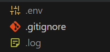
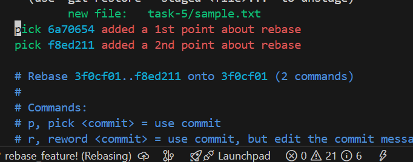
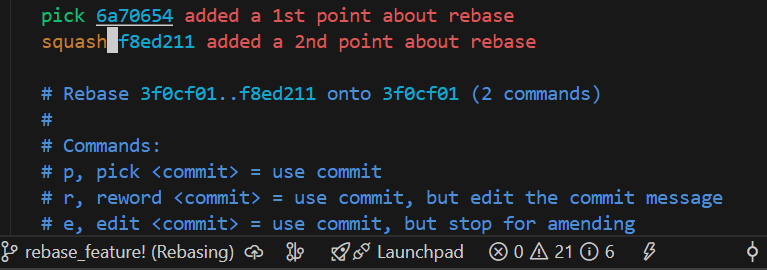
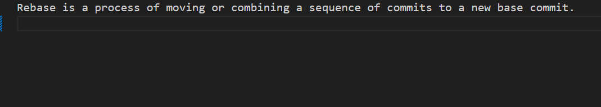
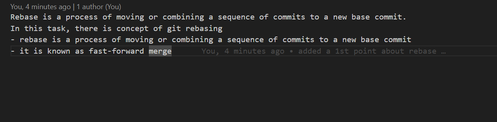
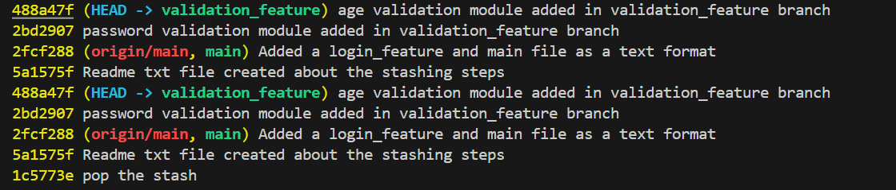
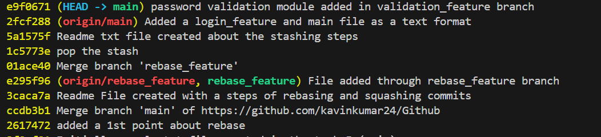

# Version Control System
- maintains a history of files
- track the changes uptodate
- helps to create a Isolated environment for each new features

# Design Pattern Present in Github
## Stack Data Structure
- all the commits history are stored in a format of stack 
- we just need to maintain a order while during pop

# Overview of this Repository
## task-1
- index.html - a sample html file uploaded from local repository
- Commands.txt - contains a description of basic commands
- style.css -  a basic styling which is applied through a creation of new branch called Styling

## task-2
- created a sample log file and env file in the local repository
- add a .gitignore file to untrack the log, env files 

- Created a text file with a git commands used

## task 3
- created a sample text file and add some more text and commit
- Discard the updated changes using checkout and restore commands
- modify that file and perform a revert operation to keep the pointer with previous commit
- 
- modify again and perform a reset operation with (--soft, --mixed, --hard) with cautions

## task 4
- created a sample txt with some text in main branch and commit to staged area
- same like that create a same sample txt with alternate content in a feature-branch and commit to staged area
- Make a conflict during merging that branch into main
- Manually resolved and checked the difference using diff commands across two branches

## task 5
- created a sample txt file in the main branch using echo
- create a antoher branch rebase_feature and add 2 point in the txt file as a seperate commit
- rebase those into main branch by interactively
-  
- squash
- 
- before rebase
- 
- After rebase
- 

## task 6
- created a sample txt and stashed them
- Work on a brench rebase_feature
- merge them back to main
- stash the pop to main branch and commit

## task 7
- created a login_feature txt and main txt in main branch
- created a new branch validation_feature and adds two files 
  (password validation, age validation)
- 

- Now i want only password_validation file for main branch so cherry pick the password_validation from validation_feature branch

