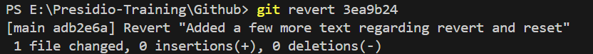

# Version Control System

- maintains a history of files
- track the changes uptodate
- helps to create a Isolated environment for each new features

# Design Pattern Present in Github

## Stack Data Structure

- all the commits history are stored in a format of stack
- we just need to maintain a order while during pop

# Overview of this Repository

## task-1

- index.html - a sample html file uploaded from local repository
- Commands.txt - contains a description of basic commands
- style.css - a basic styling which is applied through a creation of new branch called `Styling`

## task-2

- created a sample log file and env file in the local repository
- add a .gitignore file to untrack the log, env files
  
- Created a text file with a git commands used

## task 3

- created a sample text file and add some more text and commit
- Discard the updated changes using checkout and restore commands
- modify that file and perform a revert operation to keep the pointer with previous commit
- 
- modify again and perform a reset operation with _(--soft, --mixed, --hard)_ with cautions

## task 4

- created a sample txt with some text in `main` branch and commit to staged area
- same like that create a same sample txt with alternate content in a `feature-branch` and commit to staged area
- Make a conflict during merging that branch into `main`
- Manually resolved and checked the difference using diff commands across two branches

## task 5

- created a sample txt file in the `main` branch using echo
- create a another branch `rebase_feature` and add 2 point in the txt file as a separate commit
- rebase those into `main` branch by interactively
- 
- squash
- 
- before rebase
- 
- After rebase
- 

## task 6

- created a sample txt and stashed them
- Work on a branch `rebase_feature`
- merge them back to `main`
- stash the pop to `main` branch and commit

## task 7

- created a login_feature txt and main txt in main branch
- created a new branch `validation_feature` and adds two files
  (password validation, age validation)
- 

- Now i want only password_validation file for main branch so `cherry pick` the `password_validation` from `validation_feature` branch
  

## task 8

- created a initial_feature txt file and added a few more text with some API key as hard coded
- routes to git folder > hooks > created a pre-commit hook and commit-msg hook
- Write a bash script to perform a testing that empty files are not commit, catch the hard code api keys, eslint testing applied to java script files (pre-commit hook)
- write a bash script to allow that commit message is greater than four characters length (commit-msg)
- tested with git hooks and eslint then committed
  
- Installed a eslint package in the Git root folder, it may for applied to other hooks also

## task 9

- created a index html in main branch
- then created a javascript doubling function in a `javascript-multiply-results branch`
- finally created a styling for main container in `Style-main-container`

### Merged Pull Requests:

1. [Doubling Function from javascript-multiply-results - PR to main](https://github.com/kavinkumar24/Git/pull/1) - Merged from `doubling-branch` to `main`
2. [Styling Updates from Style-main-container - PR to main](https://github.com/kavinkumar24/Git/pull/2) - Merged from `styling-branch` to `main`

- 

````
    main <---- js (Doubling Function) ----> Merged
        |
        v
    main <---- style (Styling Updates of main container) ----> Merged
    
````
## task 10
- created a main branch with dashboard.txt
- created a user-auth branch for new feature and add some more files _(rebase)_
- created a transaction-fix to fix the bugs 
- created a releases branch _(rebase, reset, reflog, recover -> Handled)_
- merge `recover-build-commits` to releases
- finally merge all the branches through pull requests
