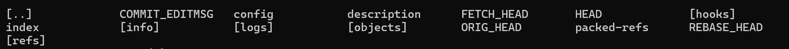
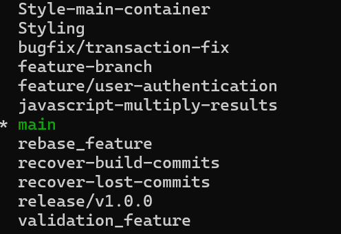

# Commands Learned

- `git init` - Initialized a folder to track the changes
content inside the `.git/` folder  
> 
- `git add` - Move the changes to staged changes for tracking
- `git commit` - save the staged changes locally (Stack data structure)
- `git branch` - to list the available branch and current point
> 
- `git branch branch_name`- to create a new branch and every new branch is a isolated environment
- `git checkout -b` - use to create a branch and auto switch instantly
- `git checkout <branch-name>`- helps to change the head pointer which lead to the pointer of tree structure

# Steps:
1. `git init`
2. `git add .` (to include all the files)
3. `git commit -m "Message"` (to commit the changes)
4. `git push origin main` (to push the changes to the remote repository)
5. `git branch branch_name` (to create a new branch)
6. `git checkout branch_name` (to switch to the new branch)
7. `git add style.css` (to add a particular file)
8. `git commit -m "Message"` (to commit the changes)
9. `git push origin branch_name` (to push the changes to the remote repository)
10. `git checkout main`(to switch to the main branch)
11. `git merge branch_name` (to merge the branch to the main branch)
12. `git push origin main` (to push the changes to the remote repository)
